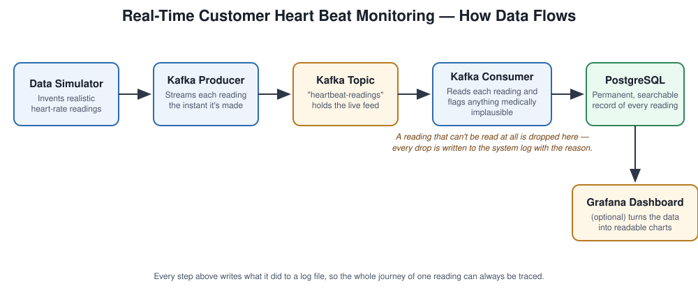

# Real-Time Customer Heart Beat Monitoring System

A small data-engineering pipeline that simulates heart-rate readings for a
set of customers, streams them through Kafka, validates them, and stores
them in PostgreSQL for querying and (optionally) dashboarding.

## Architecture



1. **Data Simulator** (`src/data_generator.py`) invents a realistic heart-rate
   reading per customer on a timer.
2. **Kafka Producer** (`src/kafka_producer.py`) streams each reading onto the
   `heartbeat-readings` topic as it's generated.
3. **Kafka Consumer** (`src/kafka_consumer.py` + `src/validation.py`) reads
   each message, flags anything medically implausible (below 30 or above 220
   beats per minute), and batches everything into Postgres.
4. **PostgreSQL** (`sql/schema.sql`) keeps a permanent, indexed record of
   every reading, flagged readings included.
5. **Grafana** (optional, via `docker-compose.yml`) can chart the stored data.

A message that can't even be read (bad JSON, missing fields) is dropped and
logged with the reason — everything else is kept and traced. See
`docs/sample_run_output.txt` for a captured end-to-end run.

## What this system does (plain language)

Imagine a hospital or fitness app with many customers wearing a heart-rate
monitor. Each device reports a reading (beats per minute) at regular
intervals. This project reproduces that flow end to end without needing
real hardware:

1. **A simulator** invents realistic-looking heart-rate readings for a pool
   of fake customers, the same way real monitors would send them.
2. **A streaming layer (Kafka)** carries those readings in real time, the
   same way a message queue would in a production system.
3. **A checking step** looks at each reading and flags anything medically
   implausible (for example, a reading of 5 or 400 beats per minute) before
   it is stored, and writes down *why* anything was flagged.
4. **A database (PostgreSQL)** keeps a permanent, searchable record of every
   valid reading, indexed by time so recent activity is fast to look up.
5. **(Optional) A dashboard** turns the stored data into readable charts.

## Project layout

```
src/                 Python source (generator, producer, consumer, db, config, logging)
sql/                 Database schema
tests/               Unit tests
docs/                Architecture diagram and screenshots
dashboard/           Optional dashboard (Grafana provisioning or Streamlit app)
docker-compose.yml   Local Kafka + PostgreSQL (+ Grafana) stack
```

## Prerequisites

- Python 3.11+
- Docker and Docker Compose (to run Kafka + PostgreSQL + Grafana locally)

## Setup (developer)

```bash
python3 -m venv .venv
source .venv/bin/activate
pip install -r requirements-dev.txt
```

## Running the local stack

```bash
docker-compose up -d
```

This starts Zookeeper, Kafka, PostgreSQL, and Grafana. PostgreSQL is exposed
on **host port 5434** (not the default 5432) to avoid clashing with any other
Postgres already running on your machine; `src/config.py` already points at
5434 by default. The database schema (`sql/schema.sql`) is applied
automatically the first time the Postgres container starts.

## Running the pipeline

In one terminal, start the producer (streams readings continuously until you
stop it with Ctrl+C):

```bash
python -m src.kafka_producer
```

In another terminal, start the consumer (reads, validates, and stores
readings continuously until you stop it with Ctrl+C):

```bash
python -m src.kafka_consumer
```

Query what landed in Postgres:

```bash
docker exec -it dem10-postgres-1 psql -U postgres -d heartbeat_monitoring \
  -c "SELECT * FROM heartbeat_readings ORDER BY reading_time DESC LIMIT 10;"
```

(Optional) open Grafana at http://localhost:3000 (login `admin` / `admin`) to
build charts against the `heartbeat_readings` table.

Application logs (including every dropped or flagged reading, with why) are
written to `logs/app.log`.

## Running tests and lint

```bash
pytest        # unit tests always run; the integration test in
              # tests/test_integration_pipeline.py auto-skips unless the
              # docker-compose stack above is up
ruff check .
```

## Status

See [implementationmap.md](implementationmap.md) for the current build phase
and design decisions (not tracked in git — ask the project owner for the
current roadmap if you need it).
